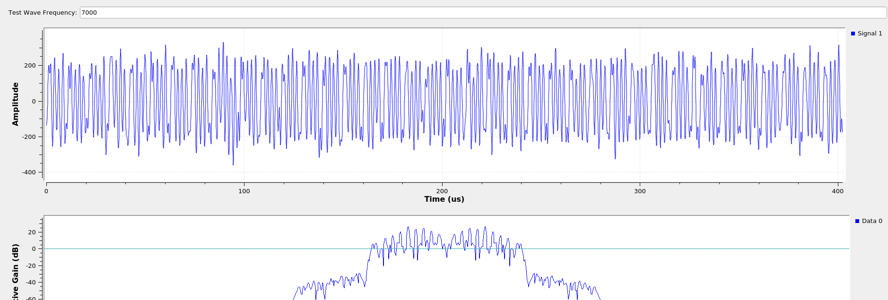

# radio-stuff

This repository documents my research into RF. This currently implements some signal recovery code for a retroreflector - code is provided as-is, you'll need to tweak thresholds and whatnot for each application.